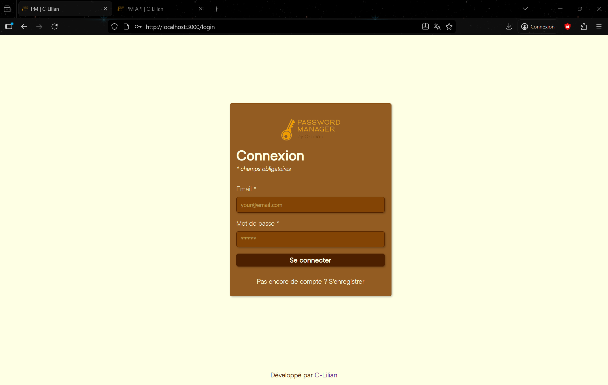
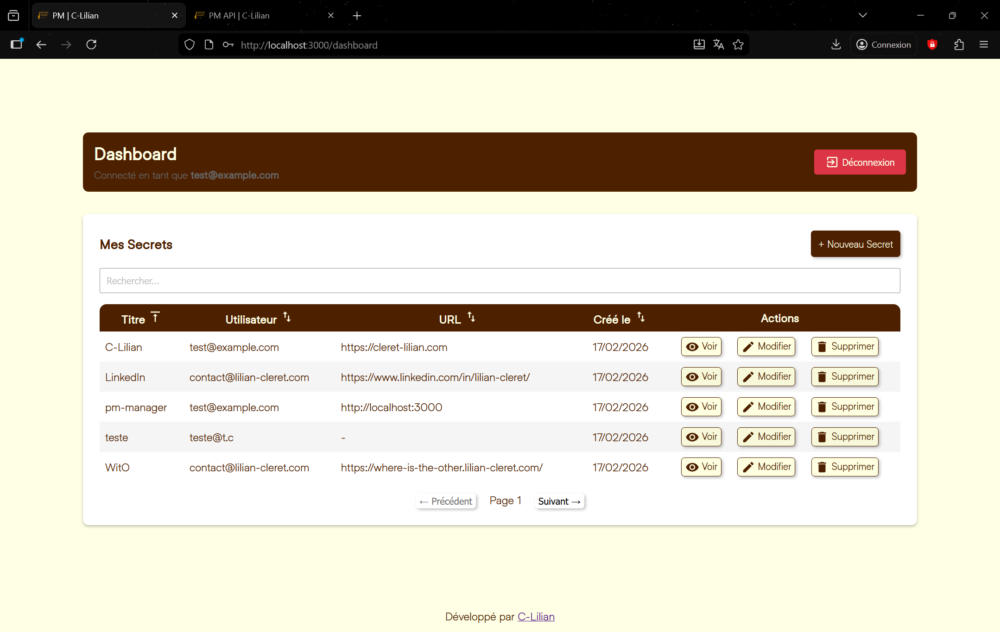
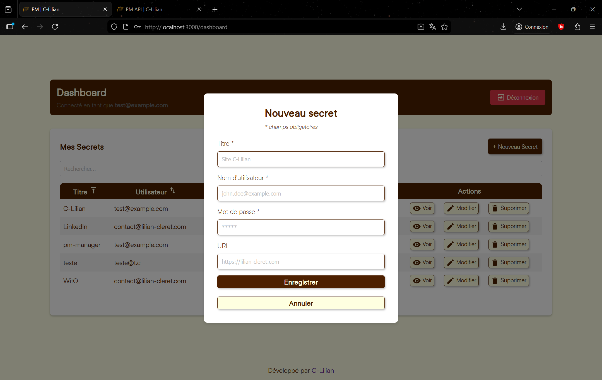
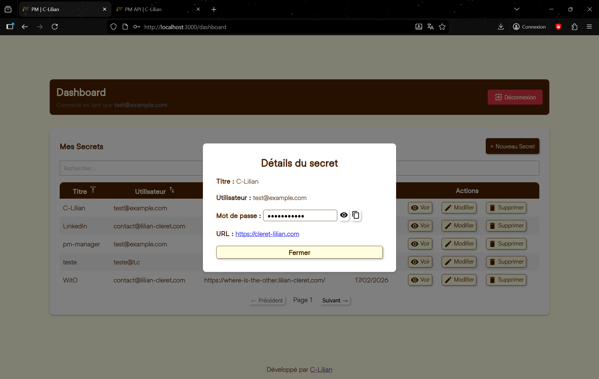
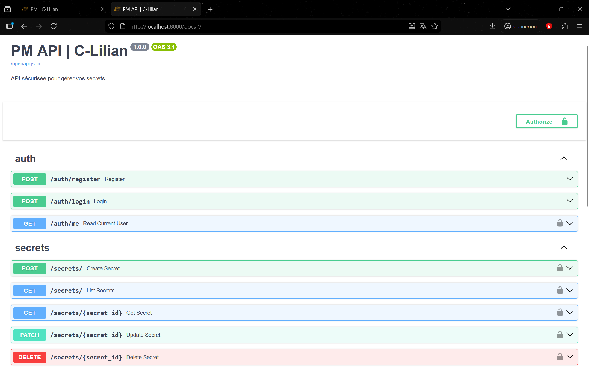

# 🔐 Password Manager – Full Stack Application

Secure password manager built with **FastAPI, React, PostgreSQL and Docker**.
The application allows users to securely store, encrypt and manage their credentials.

---

## 🚀 Features

* User authentication (JWT)
* Protected routes (frontend)
* Password encryption (AES via `cryptography`)
* Secure password hashing (`bcrypt`)
* Secrets management (CRUD)
* Pagination & search
* REST API
* Dockerized full-stack environment

---

## 🧰 Tech Stack

| 🖥 Backend | 🎨 Frontend | 🧪 Testing | 🐳 Infrastructure |
|----------|----------|----------|----------------|
| FastAPI | React 19 | Pytest | Docker |
| Python 3.11 | TypeScript | pytest-asyncio | Docker Compose |
| PostgreSQL | Vite | httpx | PostgreSQL |
| SQLAlchemy | React Router v7 |  | Git & GitHub |
| Pydantic | React Query v5 |  | ESLint |
| python-jose (JWT) | Axios |  |  |
| bcrypt | Material UI v7 |  |  |
| cryptography (AES) | MUI Icons |  |  |
| Uvicorn | Emotion (MUI styling) |  |  |
| python-dotenv |  |  |  |
| email-validator |  |  |  |
| python-multipart |  |  |  |

---

## 📸 Application Preview

### 🔐 Authentication

<p align="center">
  
</p>

---

### 📊 Secrets Dashboard

<p align="center">
  
</p>

---

### ➕ Create New Secret

<p align="center">
  
</p>

---

### 👁 View Secret

<p align="center">
  
</p>

---

### 📚 API Documentation (Swagger UI)

<p align="center">
  
</p>

---

## 🔐 Security Architecture

* Passwords are **never stored in plaintext**
* User passwords are hashed using **bcrypt**
* Secrets are encrypted using **AES (cryptography)**
* JWT tokens are used for authentication
* Token expiration configurable via environment variables

---

## 📦 Project Structure

```
password-manager/
│
├── backend/
│   ├── app/
│   ├── tests/
│   ├── Dockerfile
│   ├── pyproject.toml
│
├── frontend/
│   ├── public/
│   ├── src/
│   ├── tests/
│   ├── Dockerfile
│   ├── package.json
│   ├── vite.config.ts
│
├── docker-compose.yml
└── README.md
```

---

## ⚙️ Environment Variables

Example `.env` configuration:

```
POSTGRES_DB=password_manager
POSTGRES_USER=your_user
POSTGRES_PASSWORD=your_password
POSTGRES_HOST=db
POSTGRES_PORT=5432

BACKEND_SECRET_KEY=dev-secret-key-change-me
ACCESS_TOKEN_EXPIRE_MINUTES=30

SECRET_ENCRYPTION_KEY=encryption-key-change-me
```

⚠️ In production, always use strong and unique secret keys.

---

## ▶️ Run Locally with Docker

### Prerequisites

* Docker
* Docker Compose

### Start the project

```bash
docker compose up --build
```

### Access

* Backend API docs: [http://localhost:8000/docs](http://localhost:8000/docs)
* Frontend: [http://localhost:3000](http://localhost:3000)
* PostgreSQL: localhost:5432

---

## 🔌 API Overview

### Authentication

* `POST /auth/register` Register
* `POST /auth/login` Login
* `GET /auth/me` Read Current User

### Secrets

* `GET /secrets` List Secrets
* `GET /secrets/{id}` Get Secret
* `POST /secrets` Create User
* `PATCH /secrets/{id}` Update Secret
* `DELETE /secrets/{id}` Delete Secret

---

## 🧪 Tests

Backend tests are executed using:

```bash
pytest
```

---


## 📈 Roadmap & Future Improvements

The project has been designed with extensibility in mind.  
Several improvements and advanced features could be implemented:

### 🔐 Security Enhancements
- Two-Factor Authentication (2FA)
- Rate limiting & brute-force protection
- Secret rotation mechanism

### 🧠 User Experience & Product Features
- Dark mode
- Password strength indicator
- Built-in password generator
- Responsive mobile optimization
- Multiple secrets deletion
- Save & add another secret workflow
- Profile customization (username, preferences, security settings)
- Table personalization (visible columns, density, layout preferences)
- View mode toggle (table / card layout)
- Global sorting across all results (not only paginated items)

### 🌐 Platform Extensions
- Browser extension integration
- Desktop application
- Mobile application (React Native / Flutter)

### 🏗 Architecture & Scalability
- Multi-device session management
- API rate limiting middleware

### 🧪 Testing & Quality
- Frontend unit tests (React Testing Library)
- End-to-end testing (Playwright / Cypress)
- CI pipeline with GitHub Actions

---

## 📝 Author

Developed with passion by [C-Lilian](https://lilian-cleret.com) 🥋

Project built as part of a full-stack security-focused learning initiative.
